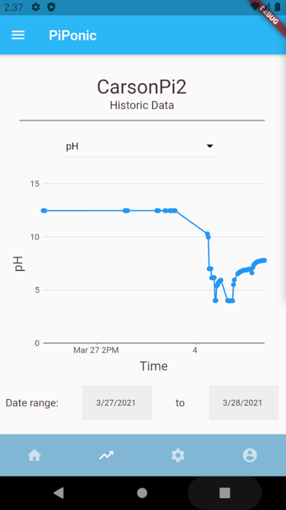

#  piponic_docs

## Project Description

This project aims to reduce urban food insecurity by reducing the cost and labour requirements of monitoring aquaponic or hydroponic food-growing systems. Designed specifically for hobbyist or small-scale growers, our project monitors critical system variables such as pH, temperature, and water-level and provides autonomous control. Critical notifications, real-time information, control settings, and system-history is available to users on a mobile application. 

 &nbsp;&nbsp;&nbsp;  &nbsp;&nbsp;&nbsp; 

Our work contributes a low-cost, open-source hardware design, and IoT development framework that will allow hobbyists to expand and modify the system for their own needs. By simplifying the communication protocols, growers can focus on adding new sensors instead of worrying about data-security. 

Our system can also operate on battery power in the event of a power-outage, a critical failure in aquaponic systems. This feature allows growers to be notified and to begin to take corrective action within the minute of the outage.

## System Overview

As you can see, the sensing and control system is attached to the aquaponic/hydroponic installation. Then, users can monitor an control their system remotely.

## This Repository

Contains key documents describing our project. This includes the following (in the `docs/` folder): 

- System Installation
- User Manual
- Requirements
- Design
- Verification and Validation

Please consult those documents for more information about the project.

## Related Repositories

- [piponic](https://github.com/jaydenleong/piponic): A sensing and control system for aquaponics or hydroponics. Runs on a Raspberry Pi and connects to the mobile application using this repository.
- [piponic_cloud](https://github.com/jaydenleong/piponic_cloud): Google Firebase functions that connect Raspberry Pis and the mobile application.
- [piponic_app](https://github.com/jaydenleong/piponic_app): The mobile application for users to remotely monitor and control their aqua/hydroponic installation. Implemented using Google's Flutter.

